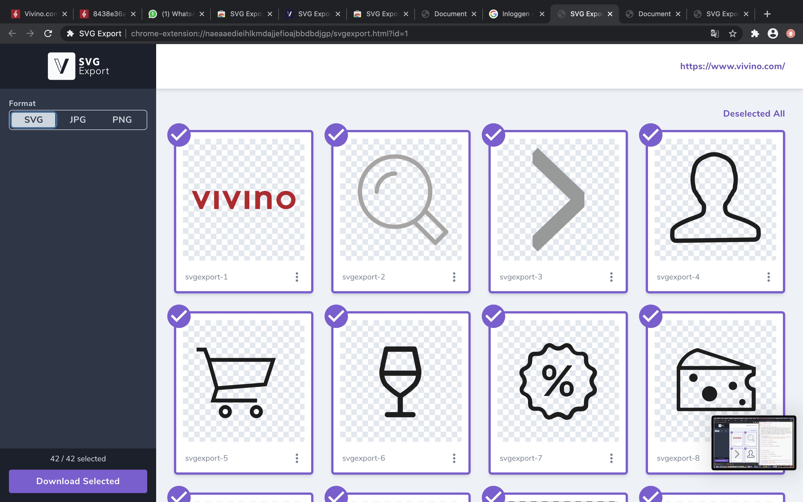
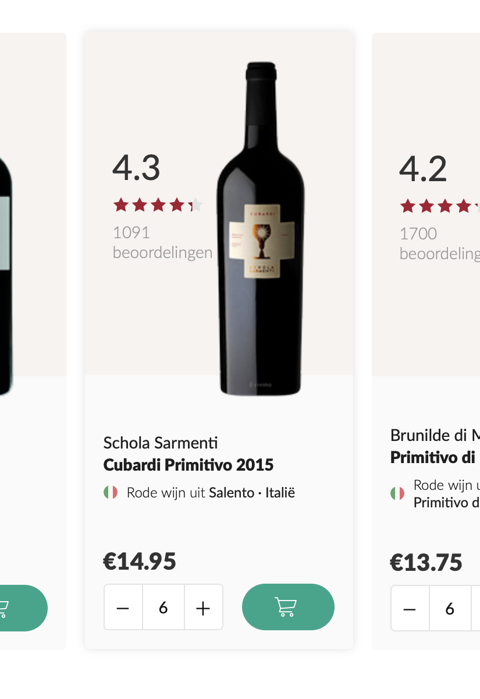
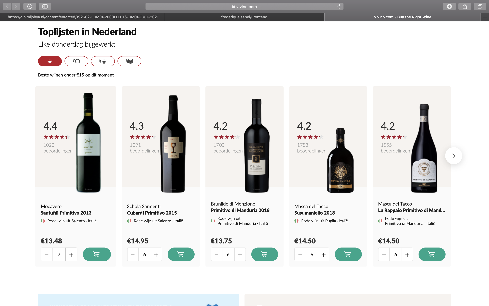
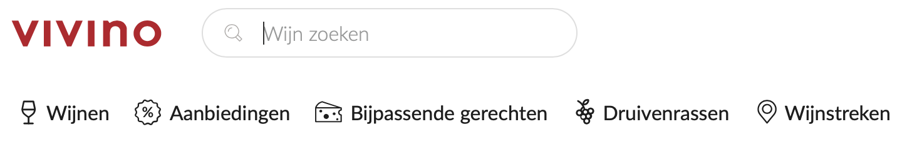
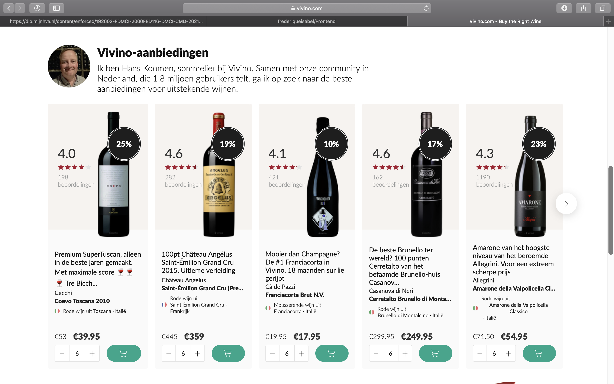
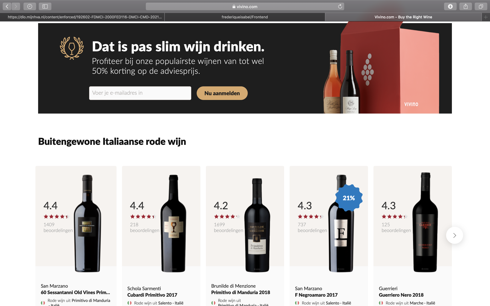
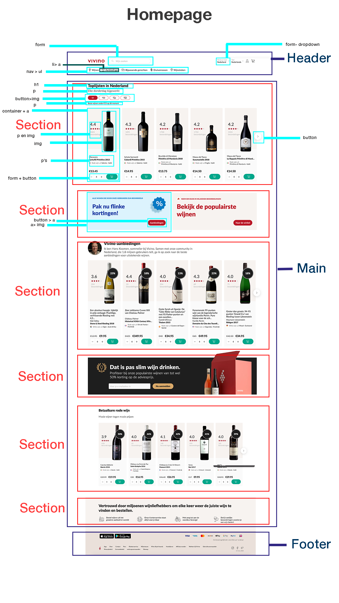

# Procesverslag
**Auteur:** -Frederique Stal-

Markdown cheat cheet: [Hulp bij het schrijven van Markdown](https://github.com/adam-p/markdown-here/wiki/Markdown-Cheatsheet). Nb. de standaardstructuur en de spartaanse opmaak zijn helemaal prima. Het gaat om de inhoud van je procesverslag. Besteedt de tijd voor pracht en praal aan je website.

## Bronnenlijst
1. -bron 1-
2. -bron 2-
3. -...-

## Eindgesprek (week 7/8)

-dit ging goed & dit was lastig-

**Screenshot(s):**

-screenshot(s) van je eindresultaat-

## Voortgang 3 (week 6)

-same as voortgang 1-

## Voortgang 2 (week 5)

-same as voortgang 1-

## Voortgang 1 (week 3)

### Stand van zaken

-dit ging goed & dit was lastig-
-Het maken van een opzet voor mijn html ging eigenlijk best wel goed. Ik vond het niet heel moeilijk en wist nog best veel van vorig jaar. Het vinden van de plaatjes van de website Vivino was wel best moeilijk. Gelukkig vond ik een SVG export programma, waardoor je alle iconen, alle svg'tjes dus, van een website kunt downloaden. Dat heeft me super erg geholpen. Vanaf toen ging het allemaal wel goed.-

**Screenshot(s):**
 

### Agenda voor meeting

-Moet je de a's werkend maken?-
-Moet je een de footer ook maken?-
-Moet je de pagina van je breakdown schets maken, of de echte pagina, want bij de breakdown schets mocht je herhalende delen weglaten.-

### Verslag van meeting

-We hebben met ons groepje besproken wat wel en niet belangrijk is bij de opdracht en bij html. We hebben een beetje overlegd wat wel en niet de bedoeling was en waar we naar gaan kijken als we feedback geven. Ook hebben we elkaar nog geholpen met wat dingen die we niet snapten en we hebben vragen bedacht om morgen te stellen. Zoals of het verplicht is om de footer ook te maken? Sommigen hadden hier twijfels over. Ook vroeg ik me af of je de links, oftewel de a's, ook werkend moet maken of niet. Ik neem aan van niet, omdat je maar 1 pagina moet maken. De meeting met mijn groepje ging goed en het was erg fijn om dingen te overleggen-

## Intake (week 1)

**Je startniveau:** -rood-

**Je focus:** -surface plane-

**Je opdracht:** -https://www.vivino.com-

**Screenshot(s):**

 
 
 
 
 
 

**Breakdown-schets(en):**

