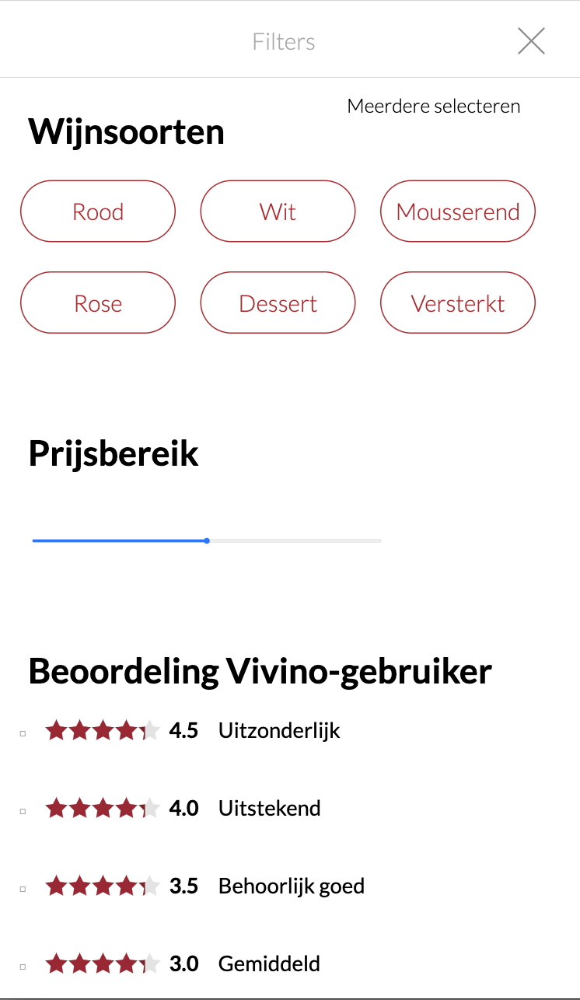
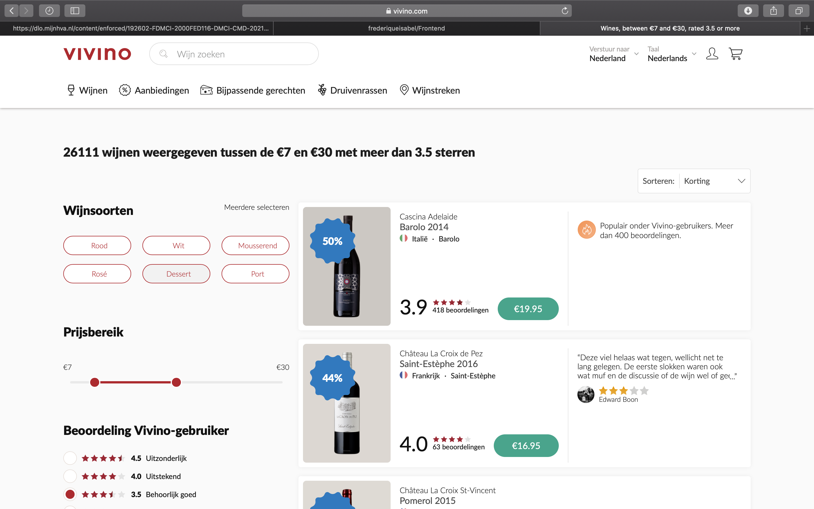

# Procesverslag
**Auteur:** -Frederique Stal-

Markdown cheat cheet: [Hulp bij het schrijven van Markdown](https://github.com/adam-p/markdown-here/wiki/Markdown-Cheatsheet). Nb. de standaardstructuur en de spartaanse opmaak zijn helemaal prima. Het gaat om de inhoud van je procesverslag. Besteedt de tijd voor pracht en praal aan je website.

## Bronnenlijst
1. -bhttps://www.appitventures.com/blog/styling-checkbox-css-tips-
2. -https://www.youtube.com/watch?v=BrpiNUf2XCk-
3. -https://www.youtube.com/watch?v=cXVbsTT5gU8-
4. -https://www.youtube.com/watch?v=cXVbsTT5gU8-
5. -https://www.youtube.com/watch?v=LMir4WUdz6U-
6. -https://www.youtube.com/watch?v=rgUp302f_lY&t=946s-

## Eindgesprek (week 7/8)

-Deze week ging voor mijn gevoel beter. Ik had mezelf weer opgepakt, ik had mezelf een dropdownmenu aangeleerd, ik heb superveel nieuwe dingen geleerd en ik schoot weer erg op. Helaas lukte veel dingen ook niet. Vooral bij het filtermenu lukten veel dingen niet. Ik snap nogsteeds niet goed waarom, maar het was gewoon heel moeilijk en ik ben er niet uitgekomen. Ik heb echt de hele week lang van 's ochtends vroeg tot 's avonds laat er aan gezeten, maar ik had veel moeite met bijvoorbeeld de dragbar in het filtermenu en de checkboxes. Ik heb hier echt uren over gedaan en het lukte me nogsteeds niet. Ik kwam uiteindelijk daardoor ook nog in tijdsnood, waardoor ik geen tijd had om overal annotaties te zetten, vooral in mijn css, want die is ook wel erg lang. Ik heb mezelf echt tot hoofdpijn gewerkt en ik baal super erg van dat dingen niet gelukt zijn. Wel heb ik in tijden niet zo gestreden voor iets, dus deels ben ik wel trots op mezelf en op hoeveel tijd ik er in heb gestoken.-

**Screenshot(s):**
 
 
 
 
 
 
 
 
 
 

## Voortgang 3 (week 6)

-Deze week ging erg lastig. Ik had een redelijk erge coronadip en ik kwam maar niet vooruit. Ookal zat ik twee uur te werken aan mijn site, het leek alsof ik niks opschoot. Deze week had ik dan ook veel stress.-

## Voortgang 2 (week 5)

-Ik ben in week 5 een stuk verder gekomen, vooral met css. Ik vond het erg leuk om aan te werken. Om dingen zo goed mogelijk na te maken. Ik had eerst een beetje moeite met een begin maken met css, maar al snel ging het best soepel. -

## Voortgang 1 (week 3)

### Stand van zaken

-dit ging goed & dit was lastig-
-Het maken van een opzet voor mijn html ging eigenlijk best wel goed. Ik vond het niet heel moeilijk en wist nog best veel van vorig jaar. Het vinden van de plaatjes van de website Vivino was wel best moeilijk. Gelukkig vond ik een SVG export programma, waardoor je alle iconen, alle svg'tjes dus, van een website kunt downloaden. Dat heeft me super erg geholpen. Vanaf toen ging het allemaal wel goed.-

**Screenshot(s):**
 

### Agenda voor meeting

-Moet je de a's werkend maken?-
-Moet je een de footer ook maken?-
-Moet je de pagina van je breakdown schets maken, of de echte pagina, want bij de breakdown schets mocht je herhalende delen weglaten.-

### Verslag van meeting

-We hebben met ons groepje besproken wat wel en niet belangrijk is bij de opdracht en bij html. We hebben een beetje overlegd wat wel en niet de bedoeling was en waar we naar gaan kijken als we feedback geven. Ook hebben we elkaar nog geholpen met wat dingen die we niet snapten en we hebben vragen bedacht om morgen te stellen. Zoals of het verplicht is om de footer ook te maken? Sommigen hadden hier twijfels over. Ook vroeg ik me af of je de links, oftewel de a's, ook werkend moet maken of niet. Ik neem aan van niet, omdat je maar 1 pagina moet maken. De meeting met mijn groepje ging goed en het was erg fijn om dingen te overleggen-

## Intake (week 1)

**Je startniveau:** -rood-

**Je focus:** -surface plane-

**Je opdracht:** -https://www.vivino.com-

**Screenshot(s):**

 
 
 
 
 
 

**Breakdown-schets(en):**

